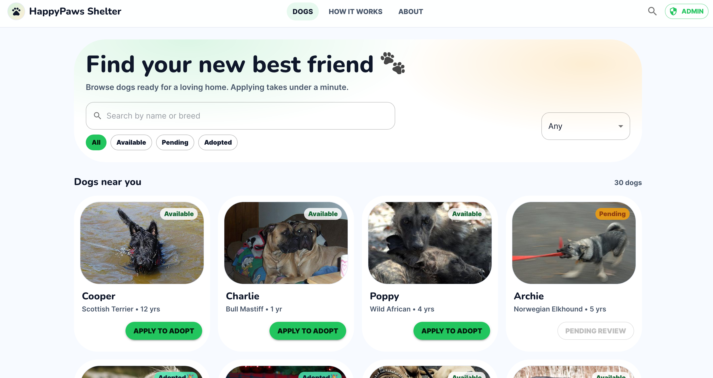
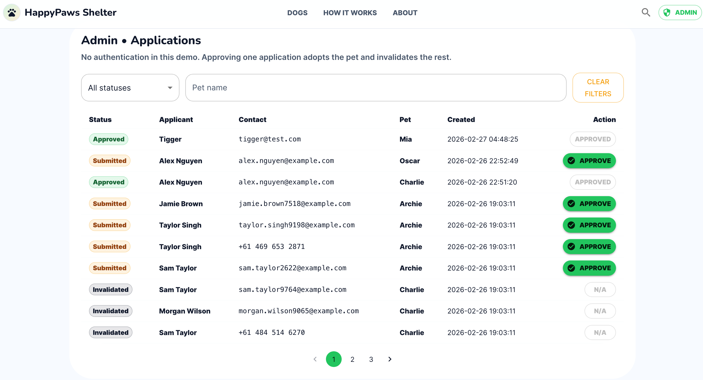

# Animal Shelter Adoption Portal (Dog Adoption)





Full-stack demo:
- **Backend**: Node.js (Express) + SQLite
- **Frontend**: React (Vite) + Material UI + React Query + React Router
- **Workflow**: Pets: `AVAILABLE → PENDING → ADOPTED` with adoption applications and an admin approve action

---

## Prerequisites (non-Docker)

- Node.js **18+**
- Python **3.10+** (for DB seeding)
- npm (bundled with Node)

Ports used by default:
- Backend: `http://localhost:4000`
- Frontend: `http://localhost:5173`

---

## Project structure (high level)

- `db/` – SQLite database + seed scripts
- `backend/` – Express API server
- `frontend/` – React app (Vite runner)

---

## 1) Seed the database (required)

From the repo root:

```bash
python db/seeds/seed.py
````

This creates/updates the SQLite file (typically `db/shelter.sqlite`).

---

## 2) Run the backend (Terminal 1)

```bash
cd backend
npm install
npm run dev
```

Backend should start on `http://localhost:4000`.

### Backend env

If you have `backend/.env.example`, copy it to `backend/.env` and adjust as needed:

```bash
cp .env.example .env
```

Common vars:

* `PORT=4000`
* `DB_PATH=../db/shelter.sqlite`
* `CORS_ORIGIN=http://localhost:5173`
* `LOG_LEVEL=info`

---

## 3) Run the frontend (Terminal 2)

```bash
cd frontend
npm install
npm run dev
```

Frontend should start on `http://localhost:5173`.

### Frontend → backend API calls

In dev, the frontend uses the Vite dev proxy so that requests to `/api/*` go to the backend.

---

## 4) Quick sanity checks

### Visitor

* Open `http://localhost:5173`
* You should see the dogs listing paginated way

### Admin

* Click the **Admin** button (top right), or open `http://localhost:5173/admin`
* You should see the applications table + approve flow + row detail modal

---

## 5) API endpoints (summary)

Visitor:

* `GET /api/pets?page=&limit=&status=`
* `GET /api/pets/:petId`
* `POST /api/pets/:petId/applications`

Admin:

* `GET /api/admin/applications?page=&limit=&status=&petId=`
* `PATCH /api/admin/applications/:applicationId/approve`

---

# Docker (recommended for “one command” startup)

## Prerequisites (Docker)

* Docker Desktop
* Docker Compose v2 (`docker compose`)

## Start everything

From the repo root:

```bash
docker compose up --build
```

Then open:

* Frontend: `http://localhost:5173`
* Backend: `http://localhost:4000`

## Stop

```bash
docker compose down
```

## Notes

* The SQLite DB is persisted via a bind mount (e.g., `./db:/data` inside the backend container).
* If you change dependencies, rebuild:

  ```bash
  docker compose build --no-cache
  docker compose up
  ```

---

## Troubleshooting

### Backend fails with sqlite3 “Exec format error”

This might happen when container `node_modules` gets mixed with host `node_modules`.
Fix:

```bash
docker compose down -v
docker compose build --no-cache backend
docker compose up
```

Ensure `backend/.dockerignore` includes `node_modules`.

---

